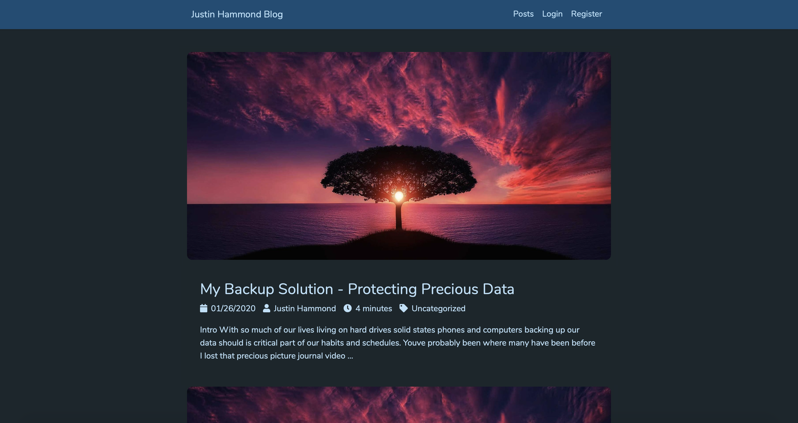

<div align="center">

# Laraview

Minimalist blog featuring syntax highlighting, images, comments, themes, and SEO out of the box.

[](https://github.com/Justintime50/laraview/actions)
[](LICENSE)



</div>

Laraview draws its simplistic design inspiration from [Medium](https://medium.com) and [Gatsby](https://www.gatsbyjs.org). Laraview allows you to quickly deploy a self-hosted blog in just a few simple steps.

**Features**

* Custom image support per post
* Comments (can be enabled/disabled)
* Syntax highlighting for code snippets
* Themes to style your blog instance
* SEO built right in with custom tags per post
* Admin panel to manage posts, comments, and users

## Install

```bash
# Copy the env file and db init file, then edit both before continuing. The DB values must match in both files
cp src/.env.example src/.env
cp init-db.env.example init-db.env

# Start the Docker containers (edit docker-compose.yml to your needs prior)
docker-compose up -d

# Generate a Laravel key
docker exec -it laraview php artisan key:generate

# Run database migrations once the database container is up and able to access connections
docker exec -it laraview php artisan migrate
```

## Usage

### Default Login

The default login is `admin@laraview.com` and `password`. **Make sure to update the email/password after first login!**

### Install in Subfolder (Optional)

There is a guide on how to do this [here](https://serversforhackers.com/c/nginx-php-in-subdirectory).

### Traefik (Optional)

The `docker-compose` file in this project uses Traefik for routing web traffic to it. You can either toss those references or follow the guide [here](https://github.com/Justintime50/multisite-docker-server) about configuring Traefik for this project.

## Development

```bash
# Install dev dependencies
cd src && composer install -q --no-ansi --no-interaction --no-scripts --no-suggest --no-progress --prefer-dist

# Run tests
./src/vendor/bin/phpunit
```

### PHP Standards Fixer

PHP coding standards can be fixed automatically by running: 

```bash
php-cs-fixer fix laravel --verbose --show-progress=estimating
```

### Seeding Database

You can seed the database with 5 dummy users and 5 dummy posts by running the following:

```bash
docker exec -it laraview php artisan db:seed
```
